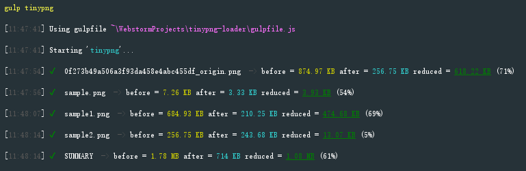
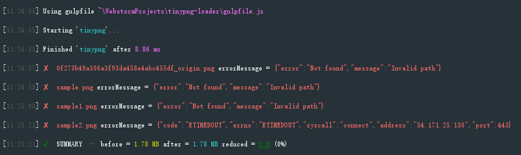

# tinypng-loader

PNG is useful because it's the only widely supported format that can store partially transparent images.
When app moves to production stage, image compression is essential. However, according to my experience using
such as gulp-image, imagemin-webpack, most of them relied on optipng plugin. This compression algorithm only help reduce
around 5%-10%. [tinypng.com](https://tinypng.com) uses smart lossy compression techniques to reduce the file size of PNG/JP(E)G files
with around <b>60%-70%</b> file size reduction.

Here is a [command line way](https://github.com/jf3096/tinypng-loader-cli) if you just want to quickly use it without any coding.

### Advantage
By compare to other tinypng library, this library use a tinypng "loophole" API to compress images.
Support popular build tools gulp and webpack so that developers can easily used this in and <b>only in Production stage</b> (Since this library rely on tinypng web api which require network accesss)

### Compatible Image
* PNG
* JP(E)G

### Get Started
```bash
npm install tinypng-loader --save-dev
```

### Support
* Webpack
* Gulp

### Language
* Typescript
* Javascript

## Example

### Gulp

Added maxConcurrency as an option. By default its value is 10. <br />
<strong>WARNING: due to the limit from tinypng.com, please keep this value under 20.</strong>

```javascript
    var gulp = require('gulp');
    var gulpTinyPng = require('tinypng-loader/gulp/index');
    gulp.task('tinypng', function(cb) {
        gulp.src('test/img/**/*.png')
            .pipe(gulpTinyPng({maxConcurrency: 10}))
            .pipe(gulp.dest('test/dist'))
            .on('end', cb);
    });
```

### Webpack
```javascript
    ...
    module:{
        ... //webpack loader starts from here
        {
           test: /\.png$/,
           loader: 'file!tinypng'
        },
        ... //end of webpack loader
    }
```

```javascript
    ...
    {
        test: [/\.bmp$/, /\.gif$/, /\.jpe?g$/, /\.png$/],
        use: [
            {
                loader: 'url-loader',
                options: {
                    limit: 10000,
                    name: 'static/media/[name].[hash:8].[ext]',
                }
            },
            {
                loader: 'tinypng-loader',
                options: {
                    test: /\.png$/
                },
            }
        ]
    }
    ...
```

Since such operation requires communication with tinypng.com, therefore I would suggest to use [cache-loader](https://github.com/webpack-contrib/cache-loader)
which allows to use MD5 to cache the result accordingly.

```javascript
    ...
        {
            test: [/\.bmp$/, /\.gif$/, /\.jpe?g$/, /\.png$/],
            use: [
                {
                    loader: require.resolve('cache-loader'),
                    options: {
                        cacheDirectory: path.resolve('node_modules/.cache-images')
                    }
                },
                {
                    loader: 'url-loader',
                    options: {
                        limit: 10000,
                        name: 'static/media/[name].[hash:8].[ext]',
                    }
                },
                {
                    loader: 'tinypng-loader',
                    options: {
                        test: /\.png$/
                    },
                }
            ]
        }
    ...
```

### Screenshot
Here is a normal case if you use this library correctly


Any errors occured will be logged in console


### ChangeLog

## 1.0.9 (2018-01-10)

* bug: fixed gulp in typescript require gulp options, which actually should be optional.
* feat: optimize webpack logic. added validation constraints for tinypng loaders.

## 1.0.7 (2018-01-09)

* bug: due to changes from tinypng api, it won't work for previous I fixed it and completed rewrite this tools.
* feat: added support for webpack 3.
* feat: added concurrency support for gulp when for batch processing images which require network download and upload speed.
